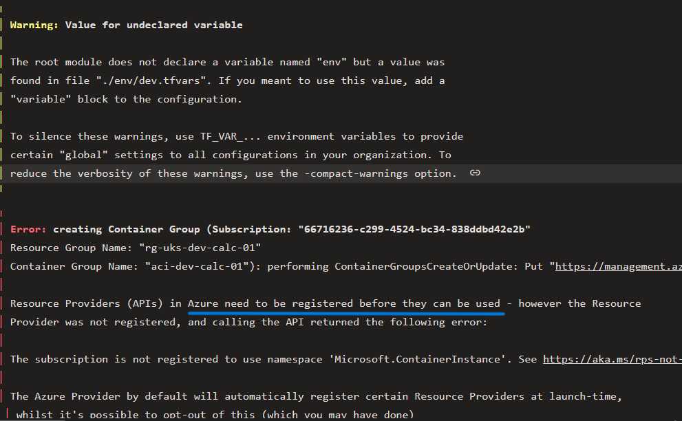
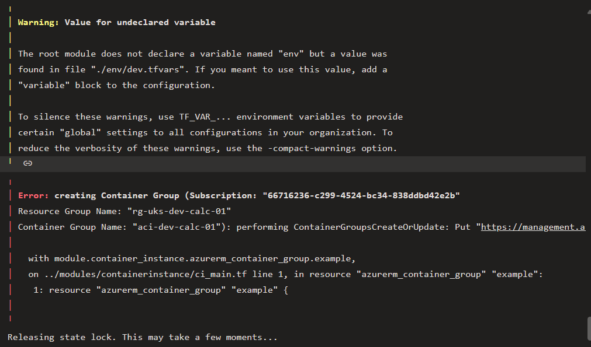

# Common Error 1

### Below is the screenshot of the common error we get when we run infra pipeline. If we read the error message it is clearly asking use to register the Resource Provider in this case it is Container Instance. 

# How to solve this

## Step 1 : Navigate to Azure portal and click on subscription

## Step 2 : when you click on your subscription scroll down to left side options you will find Resource providers, click on that

## Step 3 : Then search for container instance select that and click on register as shown below

## Step 4 : After finishing registration process refresh and then go on and run pipeline again

# Common Error 2

### Below is the screenshot of the common error2 we get when we run infra pipeline. This is because as the dns name should be unique you need to change the name before running pipeline.

### If you see below image it is clearly mentioned in comment to change dns name in vars.tf

